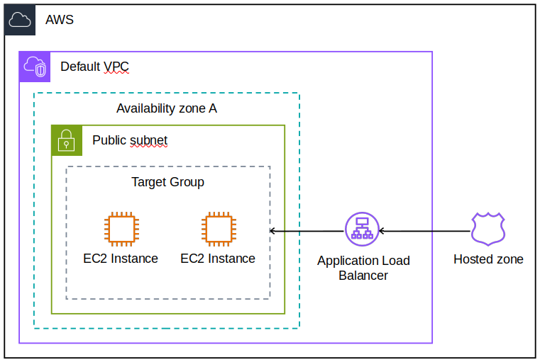

# Stateless WebApp #2

 

The 2rd part a series of projects deploying a stateless webapp on AWS using Terraform.

---

Builds on [Stateless WebApp #1](https://github.com/L7G9/stateless_webapp_01) by using an application load balancer to access multiple EC2 instances in a target group.  Uses the default VPC instead of creating a VPC and subnets from scratch.  Creates an alias record in a Route53 hosted zone enabling users to connect to the website via the load balancer using a URL.



Because this project is larger than Stateless WebApp #1 it has been divided into the following 5 modules...
- [network](https://github.com/L7G9/stateless_webapp_02/tree/main/modules/network)
- [security](https://github.com/L7G9/stateless_webapp_02/tree/main/modules/security)
- [instances](https://github.com/L7G9/stateless_webapp_02/tree/main/modules/instances)
- [load_balancer](https://github.com/L7G9/stateless_webapp_02/tree/main/modules/load_balancer)
- [route53](https://github.com/L7G9/stateless_webapp_02/tree/main/modules/route53)

---

## Getting Started

### Disclaimer
This project attempts to stay within the AWS free tier as much as possible but any charges incurred while using are not the responsibility of the Author.

### Requirements
- [Terraform & AWS CLI](https://developer.hashicorp.com/terraform/tutorials/aws-get-started/aws-build)
- [Route53 Hosted Zone](https://docs.aws.amazon.com/Route53/latest/DeveloperGuide/CreatingHostedZone.html)

###

Clone Github repository and move into project directory.
```bash
git clone https://github.com/L7G9/stateless_webapp_02.git
cd stateless_webapp_02
```

Update terraform.auto.tfvars file in a text editor with your own values.  The variables region and domain_name (from your Route53 Hosted Zone) are all required as minimum.
```
region         = "eu-west-2"
user_data_file = "/files/user-data.sh"
domain_name    = "my-domain.com"
subdomain      = "www"
```

Initialize the directory.
```bash
terraform init
```

Apply the configuration.
```bash
terraform apply
```

Copy URL from the outputs into web browser.
```bash
route53_alias_name = "www.my-domain.com"
```

Clean up.
```bash
terraform destroy
```

## Author
[@L7G9](https://www.github.com/L7G9)

---

## Acknowledgements
All these resources were used to create this project.  Thank you to all those who took the time and effort to share.
- [Udemy Ultimate AWS Certified Solutions Architect Associate SAA-C03](https://www.udemy.com/course/aws-certified-solutions-architect-associate-saa-c03/)
- [Terraform AWS getting started](https://developer.hashicorp.com/terraform/tutorials/aws-get-started/aws-build)

---
